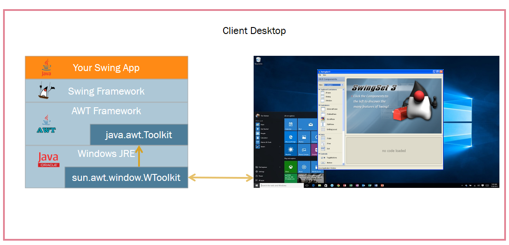
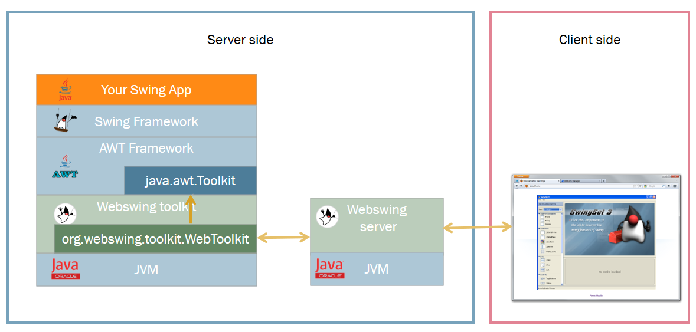

+++
title= "Documentation v2.5"
subTitle= "Webswing Documentation"
weight= 1
date = "2017-04-24T18:36:24+02:00"
+++

## Overview

[Webswing](http://webswing.org) is a specialized web server for running Swing based Java applications in your browser. 

For many years Swing has been the framework of choice for many companies and individuals for creating rich applications.
They all invested lot of money and effort into developing these applications. But nowadays Swing framework is becoming the limiting factor 
for them, because they are not able to use these applications in modern web browsers. And with the Applet technology support being 
discontinued, it leaves these companies with very few options. 

This is where Webswing comes in rescue. With virtually no extra work the Swing application or Applet can instantly be used in a browser just like the native application.
All it takes is a simple configuration using the built-in admin web interface.

Webswing offers a unique and instant solution for: 

* **[Swing Applications](config/swing)**
* **[Java Applets](config/applet)**
* **[Netbeans Platform Applications](config/netbeans)**
* **JavaFx Applications (beta)**

all this with:

* **No browser plugin required - only HTML5**
* **No code modification or conversion**
* **Works with every framework**

And as a bonus you get:

* **monitoring**
* **live control of user sessions**
* **recording and playback of sessions**
* **memory, CPU usage statistics** 
* **logs viewer**
* **advanced access control**

---

## Who is it for?

Webswing was created for existing Swing based applications and Applets. If you have a Swing application you would like to deploy in cloud, as SaaS, or you are looking for
a way to support your Applet on modern browsers, Webswing is a great option for you.

>native JavaFx application support (beta) has been added to 2.5 version

If you are just starting to develop a new application and you are looking at Webswing, you might want to consider other web frameworks first (like Vaadin, Angular or React).
However, Webswing can be useful in situations when your web application needs to use a swing based component that would be difficult to implement in native web technologies. 
Webswing views can be easily integrated and managed inside other web applications leveraging the built-in [JsLink](integrate/jslink) (java-to-javascript) interface.    

Running your application in Webswing brings many advantages compared to standard desktop use, such as:

* **Swing application codebase protection**
* **Easy distribution of new application version**
* **Control of Java version used for running Swing applications**
* **No security threats from outdated Java runtime on client machines**
* **Faster connection to backend services**
* **Centralized access management**

But it has some technology limitations too:

* It does not work well with multimedia applications - video or sound is not supported     
* 3D accelerated content is not supported 
* Due to higher rendering latency, things like action games will not work very well
* Requires more server resources (cpu/memory) per session compared to native web applications

---

## What features are supported?
 
Webswing provides many convenient integrated features which makes working with Webswing applications as easy as if they were running locally. 

* **[Printing integration](integrate/desktop) with preview**
* **[Filesystem integration](integrate/desktop) - download / upload / delete  files in isolated folder**
* **Advanced [Clipboard integration](integrate/desktop)**
* **[JsLink](integrate/jslink) - JavaScript to Java calls and vice versa**
* **[Embeddable JavaScript](integrate/browser) - embed Webswing in your web page**
* **[Session recording and playback](integrate/browser) capability built-in**
* **[DirectDraw](contrib) - rendering directly from Java2d to HTML Canvas**
* **Configurable Swing window decoration themes**
* **Java 7 and 8 support**

On Server you can 

* **Configure and monitor your applications from admin console**
* **Use Multi Tenant Deployment with isolated login contexts**
* **Use one of built-in security providers (including SAML2 or OpenID Connect) or create your own**
* **Mirror view - see what users see from admin console**
* **Use your own branding**

## How does it work?

Swing API is by design cross-platform, which means all interactions with platform dependent features happen through a well defined minimal interface (java.awt.Toolkit). 
Java ships with platform specific implementations for Windows, X11 and Mac. 

Webswing defines a new platform implementation for "Web", which simply turns 
web browser to a virtual desktop and translates platform specific actions to browser actions in best possible way.

There are two core actions that every platform has to provide for Swing. 

* Display content on screen
* Generate user input events

Webswing displays the content in browser using HTML Canvas and captures keyboard and mouse events in javascript to generate Swing input events.

 

 