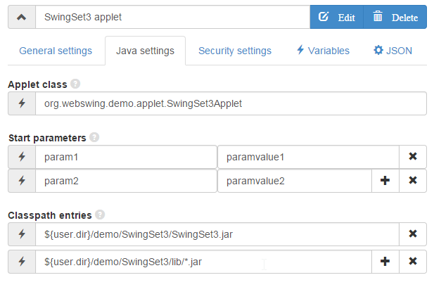

##Java Applet configuration

Webswing now offers a solution for running applets in web browser after the support of java plugins are slowly being discontinued in modern browsers. Java applets are not supported any more in current versions of Chrome browser: [NPAPI support removed from Chrome](https://java.com/en/download/faq/chrome.xml).

Webswing offers a easy way to continue using your applets on your page the same way you did before, but more securely and reliably. No more strugling with getting your applet to run for clients. Here is how it works.

**Applets support:** 

* **[Embeding to your web page](browser.md)**
* **[Java <-> Javascript interface](jslink.md)**

---

##Setup your applet in webswing server

In Admin console you can set up your java applet in `Settings` -> `Server configuration` -> `Applets`. Most of the settings in the panel are same as with standard [Swing applications](swing.md), the only diference is in `Java settings` tab, where you set up your `appletClass` and additional `parameters` for applets.



This is how a sample java applet configuration looks like in json:

```json
"applets" : [ {
    "name" : "SwingSet3 applet",
    "icon" : "${user.dir}/demo/SwingSet3/icon.png",
    "appletClass" : "org.webswing.demo.applet.SwingSet3Applet",
    "classPathEntries" : [ "${user.dir}/demo/SwingSet3/SwingSet3.jar", "${user.dir}/demo/SwingSet3/lib/*.jar" ],
    "vmArgs" : "-Xmx128m -DauthorizedUser=${user}",
    "homeDir" : "demo/SwingSet3/${user}",
    "maxClients" : -1,
    "antiAliasText" : true,
    "swingSessionTimeout" : 100,
    "authorization" : false,
    "isolatedFs" : true,
    "debug" : true,
    "authentication" : false,
    "directdraw" : false,
    "allowDelete" : false,
    "allowDownload" : false,
    "allowUpload" : false,
    "allowJsLink" : true,
    "parameters" : {
      "param1" : "paramvalue1",
	  "param2" : "paramvalue2"
    }
  } ] 
```

**`appletClass`** This is the "main" class of your Java Applet, which extends `java.applet.Applet` class.

**`parameters`** For setting custom applet parameters. 

>Note: rest of the properties are documented in [swing application setup page](swing.md)