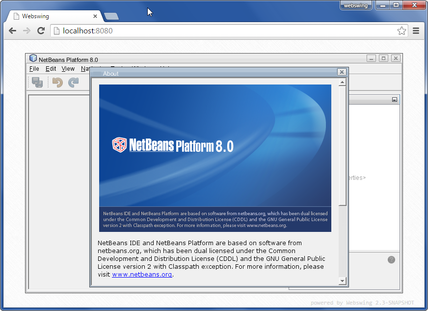
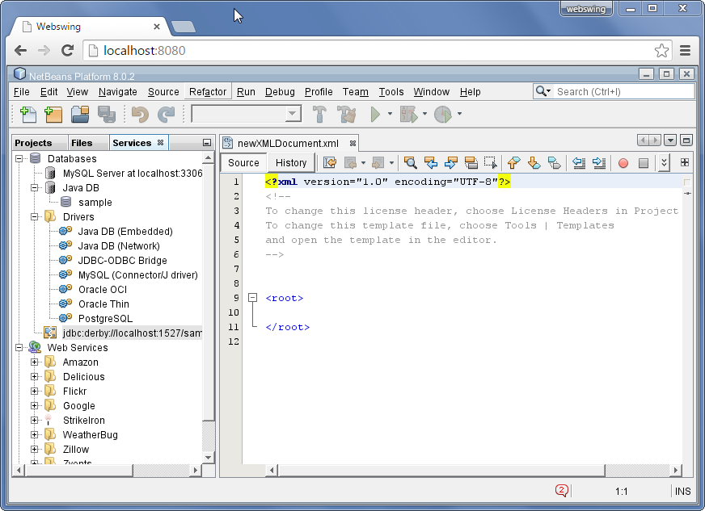

##Netbeans Platform Application setup

In general Netbeans platform applications are configured the same way as [regular swing applications](swing.md). We can use Admin console or edit the `webswing.config` file manualy. There are however few specific settings that are necessary for running Netbeans in Webswing.

In webswing distribution there are two examples for setting up Netbeans platform. 

---

##Simple Netbeans setup

First is a minimalistic Netbeans platform demonstration bootstraped with simple main class, not using the standard Netbeans packaging, which use shell script or exe file for bootstraping the application. Here is how its configured in Webswing: 

```json
{
    "name" : "NetBeans Platform",
    "mainClass" : "org.webswing.demo.NbMain",
    "classPathEntries" : [ "nbplatform.jar", "lib/*.jar" ],
    "vmArgs" : "-Dorg.netbeans.log.startup=print -DTopSecurityManager.disable=true",
	//rest of the json omited
}  
```

Most important part here is the `-DTopSecurityManager.disable=true` property in `vmArgs`. This tells Netbeans to disable its default Java Security Manager which would otherwise prevent Webswing to do its magic. 

We are using our own main class to bootstrap the Netbeans application. This is the only class located in `nbplatform.jar`. The `lib` folder contains the smallest subset of Netbeans libraries for starting the NB platform window. This is the content of main class:

```java
package org.webswing.demo;

public class NbMain {
	public static void main(String[] args) throws Exception {
		org.netbeans.core.startup.Main.main(args);
	}
} 
```



---

##Full Netbeans IDE setup

Second example included in distribution is the full blown Netbeans 8 IDE. The Netbeans installation itself is not included in the Webswing distribution for  for obvious reasons. So before running it, you will need to set up the `homeDir` property in `webswing.config` file to point to your Netbeans installation.

Here is the snippet of relevant part of Webswing confiuration for Netbeans IDE:

```json
 {
    "name" : "NetBeans IDE (set homeDir)",
    "mainClass" : "org.netbeans.Main",
    "classPathEntries" : [ "platform/lib/*.jar","platform/lib/*/*.jar" ],
    "vmArgs" : "-Dnetbeans.user=${user.dir}/tmp/netbeans/${user} -Dnetbeans.home=platform  -Dorg.netbeans.log.startup=print -DTopSecurityManager.disable=true -Dnetbeans.dirs=\"platform;nb;ergonomics;ide;extide;java;apisupport;webcommon;websvccommon;enterprise;mobility;profiler;python;php;identity;harness;cnd;dlight;groovy;extra;javacard;javafx\"",
    "args" : "",
    "homeDir" : "c:/Program Files/NetBeans 8.0.2",
    //rest of configuration ommited...
}
```
>Note: this setup is for unmodified folder structure of Netbeans IDE. 

This configuration mimics the shell script that initializes Netbeans IDE. Similar setup can be used for Netbeans platform applications that use the standard Netbeans packaging. 

Here are the most important parts of the setup explained.
 
**`mainClass : "org.netbeans.Main"`**

Main class for Netbeans will always be the above in case you are using standard way of packaging. 

**`"classPathEntries" : [ "platform/lib/*.jar","platform/lib/*/*.jar" ]`**

These folders contains the Netbeans libraries that are necessary for bootstraping the NB application. Always use only these folders. Netbeans will load the rest of libraries by its plugin system.

**`"vmArgs" : "-Dnetbeans.home=platform"`**

This setting tells Netbeans where to look for platform libraries and resources.

**`"vmArgs" : "-Dnetbeans.user=${user.dir}/tmp/netbeans/${user}"`**

Netbeans create its user session files in folder specified by this setting. It is good to have it different for each user, therefore we include the webswing specific variable `${user}` to the path. 

**`"vmArgs" : "-DTopSecurityManager.disable=true"`**

As noted above this will allow Webswing to do the magic.

**`"vmArgs" : "-Dnetbeans.dirs = \"platform;nb;ergonomics;ide;extide;java;apisupport...`**

This property will tell Netbeans which folders to look into for initializing the plugins. You can use the subset of necessary folders for your use case.
>Note: Be careful with the escaped chars like `\"` in the json configuration. It is recomended to use Admin console to avoid problems with escaping.

 