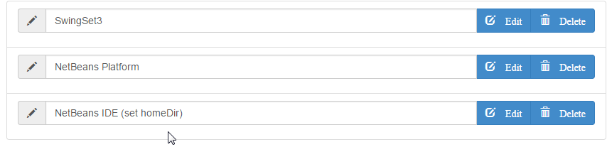
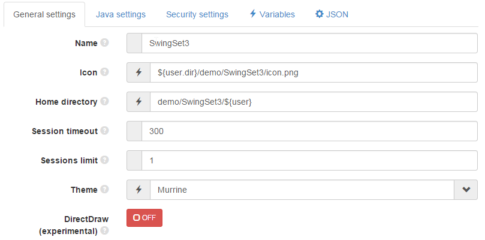
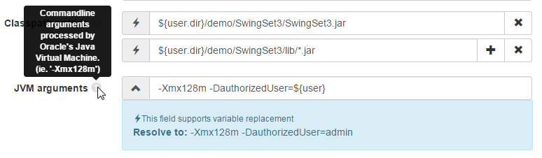
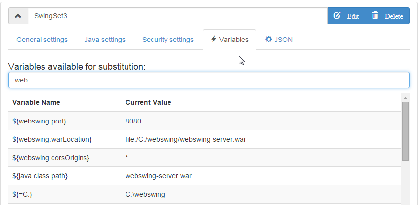

## Swing Application setup

Swing applications are configured in json format and by default saved in file `webswing.config`, which is by default placed in the same folder as the `webswing-server.war` file. This location may be changed using the `-c` command-line option. It is recommended to use Administration console's form based configuration screen to modify this file to avoid json formatting problems.

---

## Using Admin console

Easiest way of configuring your application is using Admin console. For accessing Admin console add `/admin` path to your webswing url (ie. [http://localhost:8080/admin](http://localhost:8080/admin)).

Then go to `Settings` -> `Server configuration` -> `Swing applications`. You can see the list of configured applications. You can add new or edit existing applications here. 

 

By selecting one of the application in the list it will expand the configuration panel where you can edit or view the settings. These are split in 3 panels:

 

Each setting has a description, which is displayed when hovered on the question mark.

 

---

## JSON format description

Here is a sample `webswing.config` file content with demo swing application configured:
```json
{
  "applications" : [{
    "name" : "SwingSet3",
    "icon" : "${user.dir}/demo/SwingSet3/icon.png",
    "mainClass" : "com.sun.swingset3.SwingSet3",
    "classPathEntries" : [ "${user.dir}/demo/SwingSet3/SwingSet3.jar", "${user.dir}/demo/SwingSet3/lib/*.jar" ],
    "vmArgs" : "-Xmx128m -DauthorizedUser=${user}",
    "args" : "",
    "homeDir" : "demo/SwingSet3/${user}",
    "maxClients" : 1,
    "antiAliasText" : true,
    "swingSessionTimeout" : 300,
    "authorization" : false,
    "isolatedFs" : true,
    "debug" : true,
    "authentication" : false,
    "directdraw" : false,
    "allowDelete" : true,
    "allowDownload" : true,
    "allowUpload" : true,
    "allowJsLink" : true 
  }]
}
```

---

## Variable resolution

Most of the text options support variable replacement. Available variables are java system properties, os environment variables and set of special webswing vartiables. List of all available variables and their values are available in Admin console. Variables are specified with dolar folowed by variable name in curly brackets. For example `${variable_name}`.

In aditions to variables, for `classPathEntries` properties it is possible to use wildcard characters. Supported wildcards are `*` (everything) and `?` (any singe character). 


 


**Available variables:**

Variable Name 				| Description
----------------------------|------------
**`${user}`**					| Webswing specific logged in user name.
**`${clientId}`** 				| Webswing specific unique browser identifier. 
**`${clientIp}`**				| IP address of browser which started this application.
**`${clientLocale}`**			| Locale of browser which started this application.
**`${customArgs}`**				| Custom Arguments specified in URL parameters. [See details](browser/#additional-application-arguments)
**Java system Properties** 		| All properties accessible to server's JVM using System.getProperty method
**System environment variables**| All OS level environment variables accessible to script that started webswing server JVM. 

In Admin console options with variable replacement support appears with a flash icon. When focused a panel with resolved value of is displayed:


---

##Settings overview

`name`: Swing application name. Will be displayed in application selection screen.

`icon`: Path to icon displayed in application selection dialog. Absolute path or path relative to `homeDir`

`mainClass`: Swing application fully qualified class name. (ie. 'com.mypackage.Main')

`classPathEntries`: Swing application's classpath. Absolute or relative path to jar file or classes directory. At least one classPath entry should be specified containing the main class. Allows using `?` (any single char) and `*` (everything) wildcards.

`vmArgs`: Commandline arguments processed by Oracle's Java Virtual Machine. (ie. '-Xmx128m')

`args`: Swing application main method arguments. This string will be passed to the main method's (String[] args)

`homeDir`: Swing application's home directory. Swing application instances will be executed from this directory. This will also be the base directory of any relative classpath entries specified.

`maxClients`: Maximum number of allowed simultaneous connections for this application.

`antiAliasText`: Enables rendering of anti-aliased text. Smoothens the edges of the text.

`swingSessionTimeout`: Specifies how long (seconds) will be the swing application left running after the user closes the browser. User can reconnect in this interval and continue in last session.

`theme`: Select one of the default window decoration themes or a enter path to a XFWM4 theme folder.

`authentication`: If set to `false`, the application will be accessible for anonymous user. If `true` only authenticated user is allowed to use this application. False setting will be ignored if `authorization` option is `true`.

`authorization`: Set authorized access to this application. Only users with role same as application's name can access this application.


`isolatedFs`: If enabled, this setting will force the JFileChooser to stay inside isolated folder. The new isolated folder is created in `${homeDir}/upload` 

`debug`: Enables remote debugging for this application. After the application is started with `?debugPort=8000` url parameter from browser, it will wait for remote debugger connection on port 8000

`directdraw`: Activates the new rendering method if the clients browser supports the required technologies (typed arrays, web socket). This feature is experimental state at the moment. For more information on this method refer to Development guide. 

`allowDelete`: This options activates the 'Delete' button on the JFileChooser integration panel. If this is true, user will be allowed to delete files displayed in JFileChooser dialog.

`allowDownload`: This options activates the 'Download' button on the JFileChooser integration panel. If this is true, user will be allowed to download files displayed in JFileChooser dialog.

`allowUpload`: This options activates the 'Upload' button and drop area on the JFileChooser integration panel. If this is true, user will be allowed to upload files to folder displayed in JFileChooser dialog.

`allowJsLink`: If selected, the JSLink feature will be enabled, allowing swing application to invoke javascript and vice versa. (See `netscape.javascript.JSObject`)