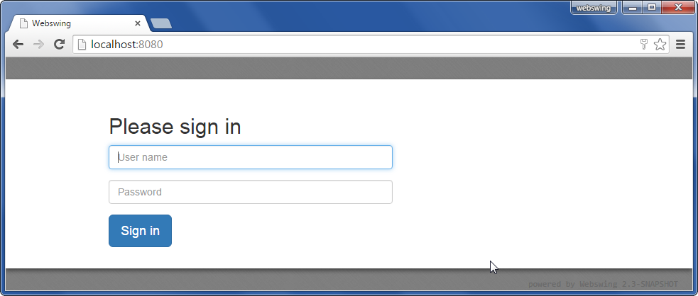
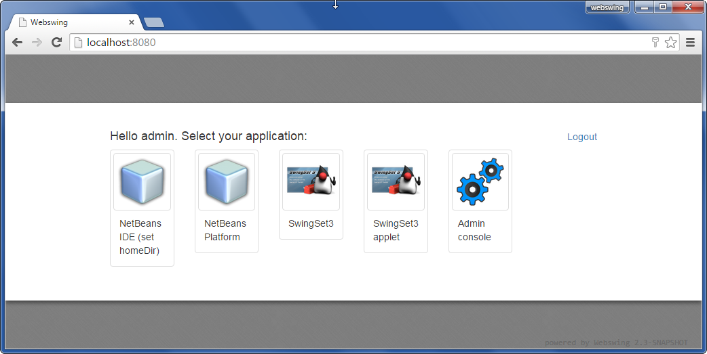
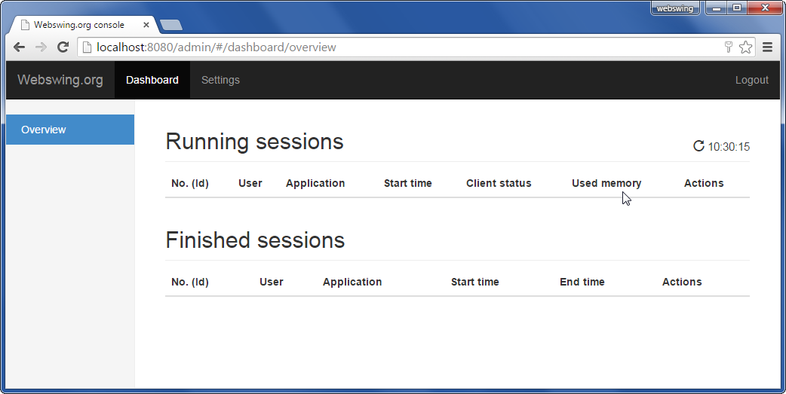
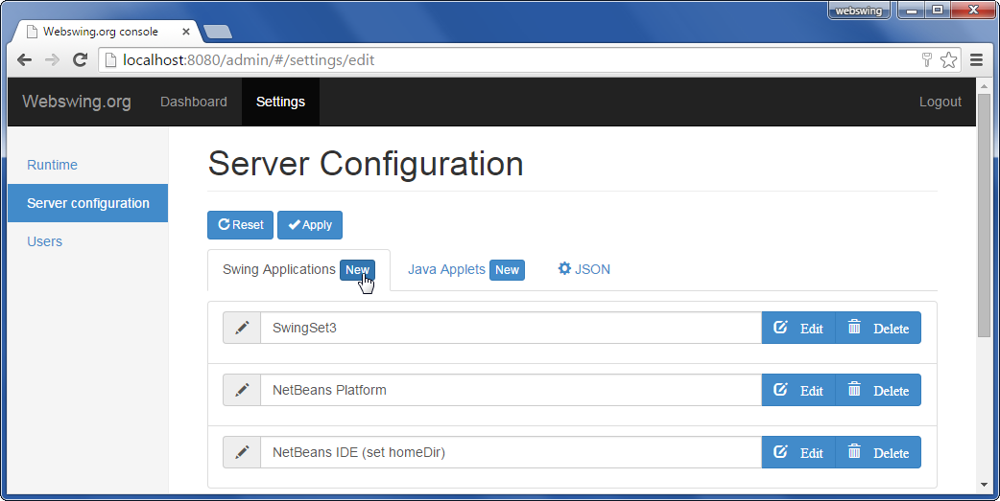
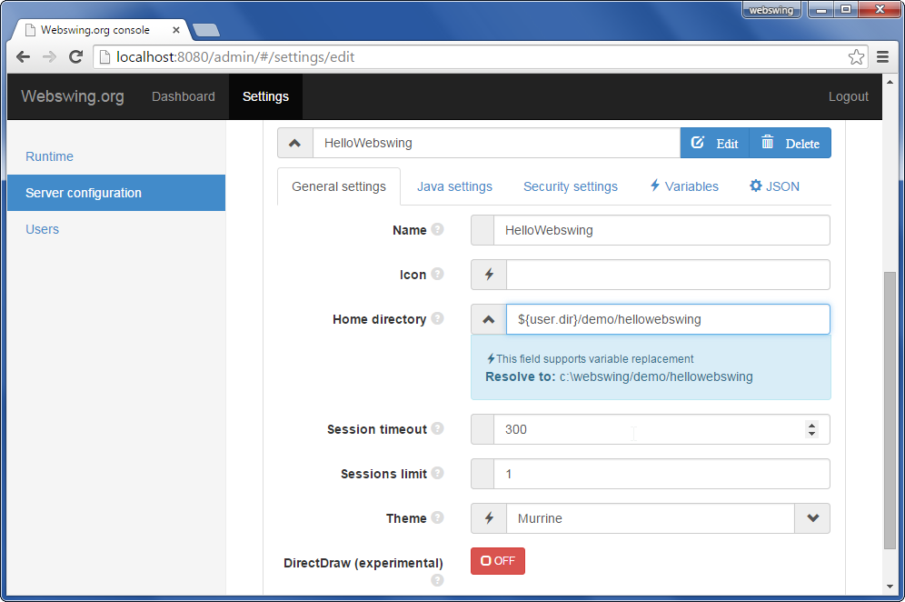
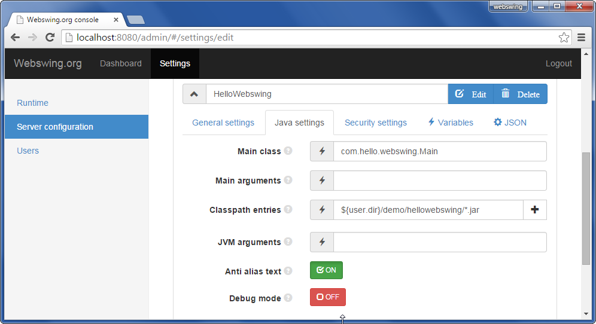
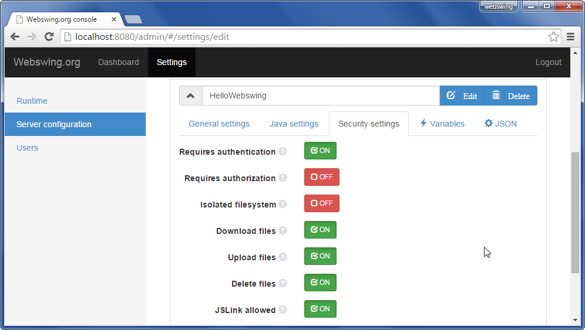
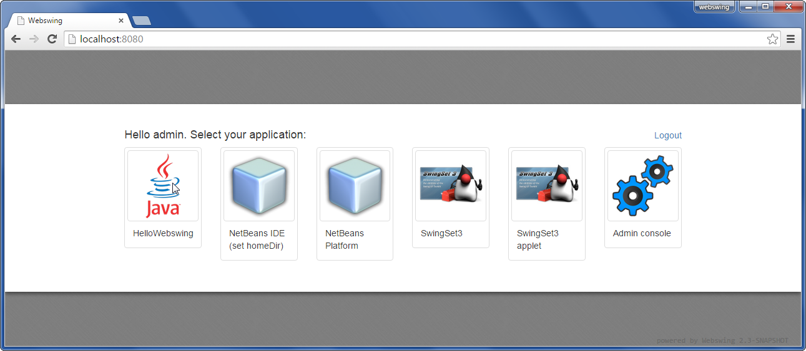
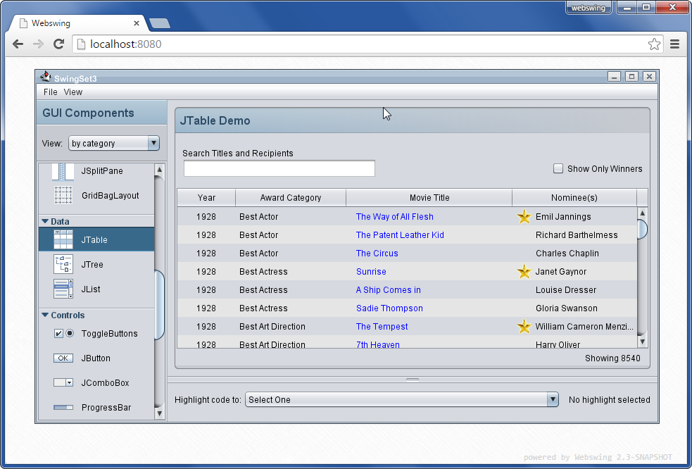

##Webswing documentation

Bring your swing applications to web browser. Instantly. 

Webswing project page [Webswing.org](http://webswing.org)

Documentation sources are located in [this folder](https://bitbucket.org/meszarv/webswing/src/HEAD/documentation/)

>Note: Please help us improve this documentation by sending us feedback or pull requests.  Any improvements or suggestions are appreciated.   

---

##Overview
Webswing is a specialized web server for running any Swing based Java application in your browser. Webswing 
offers a unique and instant solution for: 

* **[Swing Applications](app/swing.md)**
* **[Java Applets](app/applet.md)**
* **[Netbeans Platform Applications](app/netbeans.md)**

all this with:

* **No browser plugin - only HTML5**
* **No code modification or conversion**
* **Works with any custom components and frameworks**

---

##Features
 
Webswing provides many convenient integrated features which makes working with webswing applications as easy as if they were running locally. 

* **[Printing integration](app/integration.md#printing) with preview**
* **[Filesystem integration](app/integration.md#filesystem) - download / upload / delete  files in isolated folder**
* **Advanced [Clipboard integration](app/integration.md#clipboard)**
* **[JsLink](app/jslink.md) - javascript to Java calls and vice versa**
* **[Embedable javascript](app/browser.md#embeding-to-web-page) - embed Webswing in your web page**
* **[Session recording and playback](app/browser.md#webswing-url-parameters) capability built-in**
* **Mirror view - see what users see from admin console**
* **Configure your application from admin console**
* **Configurable Swing window decoration themes**
* **Java 6, 7 and 8 support**
* **[DirectDraw](dev/development.md#directdraw-rendering) - rendering directly from Java2d to HTML Canvas**

Running your application in Webswing brings many advantages compared to standard desktop use, such as:

* **Swing application codebase protection**
* **Easy distribution of new application version**
* **Control of Java version used for running Swing applications**
* **No security threats from outdated Java runtimes on client machines**
* **Faster connection to backend services**
* **Centralized access management**

---

##Quick Start Guide

This step by step guide will help you install and start Webswing server and setup your swing application in 5 minutes.

**Prerequisities**

1. JRE 6,7 or 8 installed
2. Modern browser installed  

For the purpose of this guide we will use a Windows-based box. Linux installation is covered in separate page. 

Download the distribution from [Webswing home page](http://www.webswing.org) and unzip it to new folder. For demonstration purposes we will use `C:\webswing`

Open a command prompt and make sure you are using the current java executable. (Verify by running java -version at the command prompt.)

Double click on the `webswing.bat` file to start the Webswing server.

Open your browser to address [http://localhost:8080](http://localhost:8080)

 
Login using the default username and password `admin` and `pwd`.

Now you can see the list of demo applications and the Admin console icon in the selection. Click on the `Admin console`.

In Admin console navigate to `Settings` -> `Server configuration`. Here we can add a new swing application to the `webswing.config` json configuration file.

Click on the `New` button on the `Swing applications` tab, and fill in the basic details as required. Hover over the question marks for setting explanations.

Set the application main class and classpath. 

Setup security 

Now click the `Apply` button to save and apply the new configuration.

Load the first page again,  [http://localhost:8080](http://localhost:8080), where you should see the newly configured application. 

Click on the application to start the Swing application inside the browser. 
 

In case the application failed to start, search for the problem in the log file `webswing.log` located in the webswing folder - in our case `C:\webswing`. 